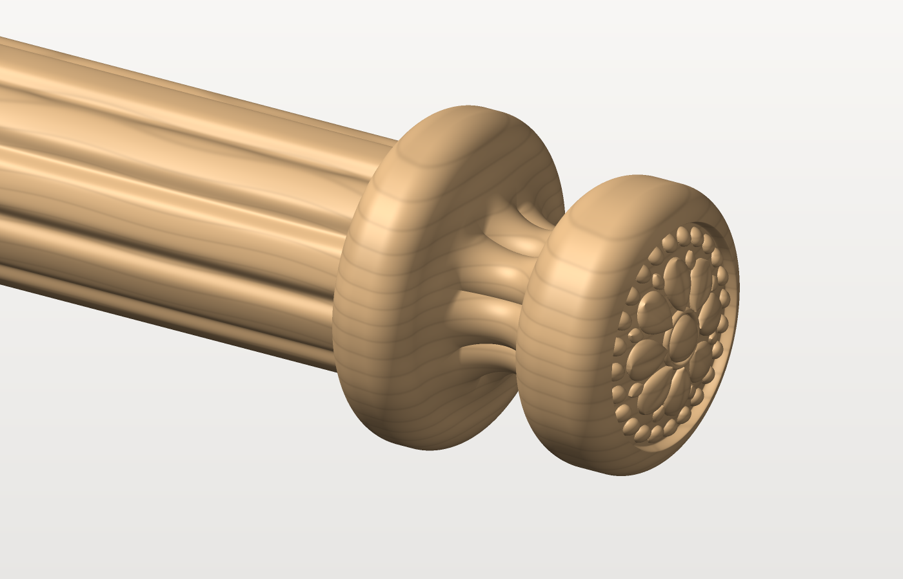
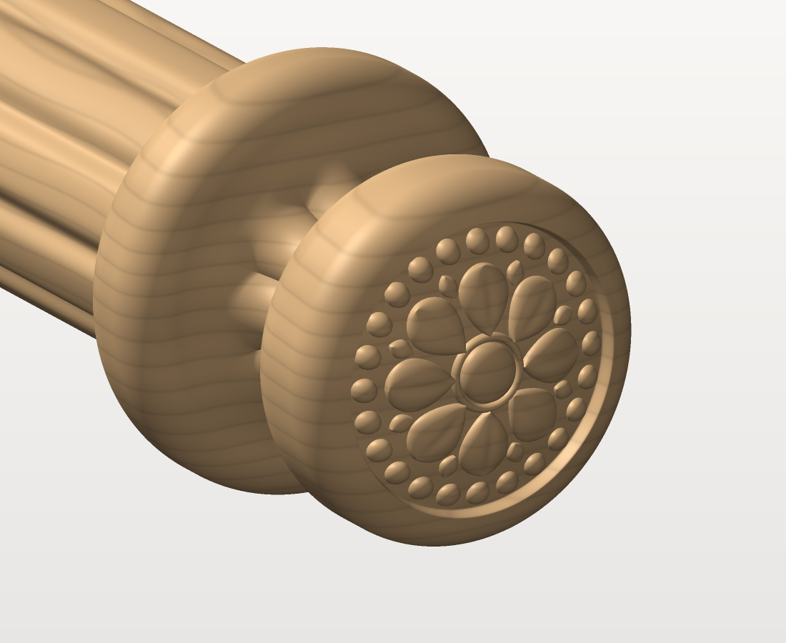

# Наконечник штанги изголовья (ясень, ЧПУ 3 оси)

Наконечник на торец рифлёной штанги шириной 40 мм — кровать из массива ясеня
с мягким изголовьем. Наконечник заметно толще штанги: воротник ⌀58, шляпка ⌀50.
Шейка с 8 острыми каннелюрами (валики, как на штанге), на торце резная розетка.




## Основные размеры

| Элемент | Размер, мм |
|---|---|
| Штанга (сопрягаемая) | ⌀40 по гребням валиков |
| Воротник у торца штанги | ⌀58 × 15, кромки R6; опорный торец ⌀46 плоский |
| Шейка | ⌀26 по гребням (в 25 мм от торца), 8 валиков, канавки глубиной 2, острые |
| Шляпка | ⌀50, поясок 5, плечо R8, скругление торца R6, купол R59,2 |
| Розетка на торце | зона ⌀40: пуговка ⌀8, 8 лепестков, 8 листков, 24 бусины ⌀3,2; фон −2,2 |
| Видимая длина | 55 (от торца штанги до вершины) |
| Шип | ⌀15,8 × 25 под отверстие ⌀16 × 30 в штанге (фаска 3,5×45°), на клей |
| Габарит детали | ⌀58 × 80; масса ≈ 60 г |

При общей ширине кровати 1900 длина штанги 1900 − 2×55 = **1790 мм**.

## Технология: 4 установки на 3-осевом станке

Тело вращения с горизонтальной осью фрезеруется сверху и снизу с переворотом —
по ±Z у него нет поднутрений. Но две вещи так чётко не сделать, поэтому для них
отдельные установки:

* **канавки на шейке**: при переворотной обработке канавки у линии разъёма стоят
  почти вертикально и выходят размытыми;
* **розетка на торце**: торец — вертикальная стенка, по ±Z на нём получаются только
  кольца, а не рельеф.

| Уст. | Что делаем | Как держим | Лист |
|---|---|---|---|
| 1 | Сторона А: черновая + чистовая (шейка и купол пока гладкие) | брус 155×205×60 на 2 детали, 2 штифта на оси переворота | Н2 |
| 2 | Сторона Б: та же программа после переворота вокруг оси X | те же штифты (⌀10 и ⌀8 — перевернуть неправильно не получится) | Н2 |
| 3 | Розетка на торце | деталь торцом вверх, шип в гнезде кондуктора | Н3 |
| 4 | 8 каннелюр на шейке | шип зажат в квадратной делительной оправке, 4 поворота по 90°, одна программа | Н4 |

Чертёж и карты наладки — [`out/finial_drawing.pdf`](out/finial_drawing.pdf) (4 листа А3).

### Инструмент (ясень, шпиндель 18 000 об/мин, ориентировочно)

| Установка | Операция | Фреза | Режим |
|---|---|---|---|
| 1–2 | черновая, припуск 0,5 | концевая ⌀8, вылет ≥ 41 | F 3000, 4 мм за проход, шаг 45 % |
| 1–2 | чистовая: растр вдоль X, затем вдоль Y | сфера ⌀8 (или ⌀6), **цилиндрическая**, хвостовик того же ⌀ | F 3500, шаг 0,4 |
| 3 | черновая розетки | концевая ⌀3 | F 1500, 1 мм за проход |
| 3 | чистовая розетки, растр 45° | конусная сфера R0,5 | F 1500, шаг 0,1 |
| 4 | каннелюры: 2 прохода по Z, затем растр вдоль X | конусная сфера R0,5, 20° | F 1500, шаг 0,1 |

В установках 1–2 сфера должна доходить до плоскости разъёма, поэтому конусные фрезы
там не годятся — они зарежут бока детали у разъёма.

### Проверено расчётом (`out/checks.txt`)

* Вогнутые радиусы профиля ≥ R4,5 — чистовая сферой ⌀8 или ⌀6 проходит везде.
* Установки 1–2, симуляция чистовой по карте высот: недорез ≤ 0,04 мм (⌀8), ≤ 0,02 мм (⌀6).
* Установка 4: запас между стенками канавок и конусом фрезы 12°; недорез на валиках ≤ 0,01 мм,
  в дне канавки — скругление радиусом кончика фрезы (R0,5).

## Файлы (`out/`)

Все размеры в миллиметрах.

| Файл | Что это | Система координат |
|---|---|---|
| `finial_drawing.pdf`, `sheet*.png` | чертёж детали и карты наладки установок 1–4 | — |
| `finial.stl` | готовая деталь целиком (каннелюры + розетка), для просмотра и контроля | ось X, опорный торец x = 0, шип в −X |
| `cnc_setup1-2_2pcs.stl` | **установки 1–2**: обе детали с перемычками, шейка и купол гладкие | станок: X0Y0 — центр бруска, Z0 — стол, оси деталей на Z = 30, Y = ±36 |
| `cnc_setup1-2_layout.dxf` | заготовка, граница кармана, контуры деталей, штифты | как выше |
| `cnc_setup3_rosette_1pc.stl` | **установка 3**: шляпка с розеткой, деталь торцом вверх | ось = Z, опорный торец Z = 0; поставить в X = ±40 |
| `cnc_setup3_fixture.dxf` | кондуктор: гнёзда ⌀15,8 × 27 с шагом 80, зоны резьбы ⌀41 | X0Y0 — между гнёздами, Z0 — верх кондуктора |
| `rosette_heightmap_16bit.png` | карта высот торца для «рельефа из изображения» (ArtCAM/Aspire); масштаб — `rosette_heightmap.txt` | центр = ось детали |
| `cnc_setup4_flutes_2pcs.stl` | **установка 4**: 2 детали с каннелюрами в ложементе | X0 — опорный торец, Y0 — между гнёздами (детали на Y = ±40), Z0 — верх ложемента, оси на Z = 15 |
| `cnc_setup4_nest.dxf` | ложемент: гнёзда оправок, жёлоба, граница обработки каннелюр (слой `FLUTE_ZONE`) | как выше |
| `fixture_setup4_nest.step/.stl` | модель ложемента (плита 30 мм) | как выше |
| `fixture_setup4_index_half.step/.stl` | половина делительной оправки 40×40×20 (на оправку 2 шт.) | — |
| `finial_body_smooth.step` | твёрдое тело после установок 1–2 (без перемычек, каннелюр и розетки) — для CAD | ось X |
| `finial_profile.dxf` | полупрофиль для «тела вращения» (слой `PROFILE`), силуэт, профиль с перемычками | ось X |
| `render_*.png` | предпросмотр | — |

### Как задать в CAM (Aspire / ArtCAM / Fusion)

* **Установки 1–2.** Толщину заготовки ввести по замеру (ось детали = T/2 от стола), Z0 — стол,
  X0Y0 — центр заготовки. Импортировать `cnc_setup1-2_2pcs.stl` без смещения.
  Черновая до Z = T/2 − 5 (сквозь разъём) — после стороны Б детали держатся только на
  перемычках (шип ⌀15,8 и ⌀10 на куполе). Одна и та же программа для обеих сторон:
  модель симметрична, а переворот идёт вокруг оси X по штифтам.
* **Установка 3.** `cnc_setup3_rosette_1pc.stl` поставить дважды — в X = −40 и +40,
  обрабатывать только внутри кругов ⌀41 (слой `ROSETTE_ZONE`). Материал сверху —
  от Z 57 (остаток перемычки на куполе).
* **Установка 4.** Импортировать `cnc_setup4_flutes_2pcs.stl` без смещения, граница —
  слой `FLUTE_ZONE`. После каждого прогона оправку повернуть на 90° и запустить ту же программу.

## Как пересобрать и изменить размеры

```bash
pip install -r requirements.txt
python build.py                                  # все файлы в out/
python build.py --set cap_d=52 collar_d=60       # другие размеры
python build.py --set rosette=0 reeds=0          # гладкий вариант (только установки 1–2)
python build.py --no-render                      # без картинок (быстрее)
```

Все параметры — в `geom.py` (класс `Params`): диаметры и длины элементов, глубина
каннелюр `reed_depth`, розетка (`petals`, `pearls`, `rosette_depth` …), заготовка и оснастка
(`stock_t`, `gap`, `frame_w`, `pin_d`, `index_block` …). Скрипт сам проверяет, что вогнутые
радиусы не меньше радиуса чистовой сферы и число каннелюр кратно 4.

Модули: `geom.py` — геометрия и проверки, `build.py` — экспорт STL/STEP/DXF и оснастка,
`drawing.py` — листы чертежа, `render.py` — картинки предпросмотра.
