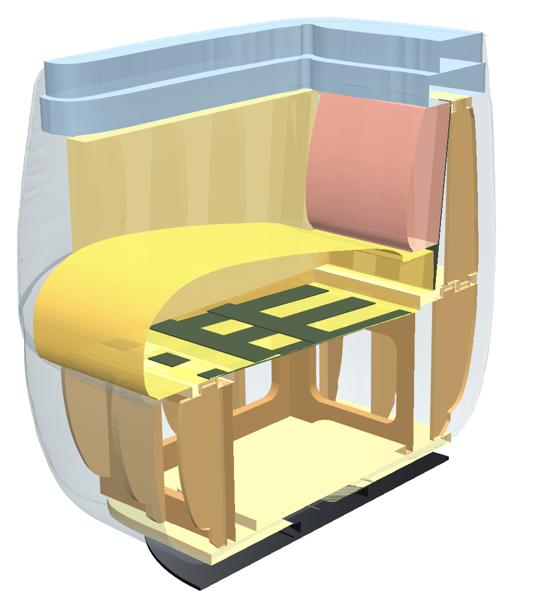

# SPIN с поворотным механизмом: каркас и поролон

Рабочий проект внутреннего каркаса и мягких слоёв кресла
[SKDESIGN SPIN](https://skdesign.ru/product/spin?productId=19f1d358-5e75-11ed-bbb5-005056abfb9b&configurationId=6302ab37-d93c-11ed-a214-00505699dabd)
в поворотном исполнении на механизме
[195×195 мм, 360°](https://market.yandex.ru/card/povorotnyy-mekhanizm-dlya-mebeli-195x195-mm-vrashcheniye-360-dlya-stulyev-i-kresel-platforma-dlya-stolov-chernyy-stal/5583855927).

Форма обивки взята из 3D-модели производителя (`Spin.max`, SK-00033861), а не нарисована на глаз.
Каркас построен по реальным сечениям этой модели: кромки всех деталей отстоят от поверхности
обивки ровно на толщину мягких слоёв. Проверка по каждой детали лежит в `out/proverka_zazorov.txt`.



## Что в папке `out/`

| Файл | Для чего |
|---|---|
| `spin_chertezhi.pdf` | 11 листов А3: общий вид, разрезы А–А и Б–Б с толщинами слоёв, основание и узел механизма, плиты, рёбра, поролон с шаблонами, раскрой, спецификация, порядок сборки |
| `cnc/raskroy_18mm_list_1.dxf`, `cnc/raskroy_15mm_list_1.dxf` | Раскрой фанеры 1525×1525 для ЧПУ, 1 лист 18 мм + 1 лист 15 мм |
| `cnc/parts/*.dxf` | Каждая деталь отдельно (P1…P4, PG1…PG3, RN1…RN10, RV1…RV7, RS) |
| `cnc/disk_osnovaniya.dxf` | Стальной диск основания Ø600×6 для лазерной резки |
| `porolon/*.dxf` | Заготовки поролона 1:1; для фигурных деталей рядом лежит боковой шаблон |
| `specifikaciya.csv` | Спецификация: фанера, ППУ, листовые материалы, ремни, крепёж (открывается в Excel) |
| `3d/spin_karkas.step` | Сборка каркаса с основанием и механизмом для CAD (Компас, SolidWorks, Fusion) |
| `3d/spin_obivka.stl` | Поверхность обивки для наложения на каркас |
| `spin_3d.html` | Интерактивный 3D-просмотр: слои, разрезы, клик по детали |
| `proverka_zazorov.txt` | Минимальная глубина каждой детали под поверхностью обивки |

DXF-слои: `CUT_OUT` — наружный контур, `CUT_IN` — вырезы и пазы, `DRILL` — сверления,
`MARK` — разметка, `TEXT` — маркировка (не резать). Масштаб 1:1, мм.

## Исходные данные

- **Каталог SKDESIGN:** 80 × 82 × 72 см, высота сиденья 47 см, глубина сиденья 53 см,
  допуск ±3 см. Каркас из берёзовой фанеры, «средне-жёсткий». Поворотная версия весит 40 кг,
  статичная 25 кг.
- **3D-модель** `Spin.max` читается собственным парсером (`lib/maxfile.py`, без 3ds Max),
  затем сглаживается как TurboSmooth (2 итерации Catmull–Clark). В плане модель на 2,5 % больше
  каталога, поэтому приведена к 800×820 (`MODEL_XY_SCALE = 0.975`); высота совпадает.
  Управляющая сетка сохранена в `data/spin_cage.npz`, поэтому сам `.max` для сборки не нужен.
- **Механизм:** площадка 195×195, высота 25 мм. Шаг крепёжных отверстий на странице товара
  не указан, в проекте принят 170 мм при Ø7 (см. «Что проверить»).

## Как делают такие кресла (изучение технологии)

Кресла-«коконы» такой формы выпускают тремя способами.

1. **Каркас из фанеры, раскроенной на ЧПУ, и листовой поролон.** Так устроены кресла средней
   ценовой группы, в том числе SPIN: в паспорте указано «каркас: фанера берёзовая, поролон, ткань».
   Детали проектируют в CAD и режут на ЧПУ с оптимальной раскладкой на листе. Несущие детали
   делают из фанеры 18 мм, вспомогательные тоньше: например, кресло Armchair 512 у
   [Trubnikov Furniture Frames CNC](https://cncframes.furniture-3d.com/product/armchair_512/)
   собрано из фанеры 18 и 12 мм. Детали соединяют шип–паз на клею ПВА со скобами
   (от 19 мм, пневмостеплер) и шурупами; большие узлы усиливают бобышками
   ([обзор конструкций каркасов](https://furniturefair.net/blogs/lc/how-does-construction-affect-quality)).
   Округлую поверхность формируют лекалами-рёбрами и тонким листом поверх них (ДВП, фанера 3–4 мм).
   У tub chair по стойкам снаружи идёт лист ДВП, поверх — поролон
   ([пример](https://www.home-dzine.co.za/diy-1/diy-tub-chair.html)). Сиденье ставят на
   эластичные ремни или пружинную змейку.
2. **Стальной каркас и формованный (литьевой) ППУ.** Так делают серийные дизайнерские модели,
   в том числе поворотные: у Moroso, например, «injected polyurethane foam over an internal steel
   frame» со стальным поворотным основанием
   ([Pacific](https://hivemodern.com/pages/product15646/pacific-armchair-patricia-urquiola-moroso)).
   Формованный ППУ служит дольше блочного, но требует пресс-формы и оправдан только в серии
   ([описание технологии](https://elladappu.ru/production/)).
3. **Пластиковая или гнутоклеёная оболочка с поролоном.** Для этой формы (глубокий «горшок»
   со вспухшими боками) не подходит.

Для этого проекта выбран **способ 1**: он повторяет исходную конструкцию SKDESIGN и не требует
оснастки. Из практики производителей взято:
- рёбра-лекала 15 мм и плиты с перегородками 18 мм;
- шип–паз с «собачьими косточками» под фрезу;
- клей со скобами или саморезами;
- гибкие полосы обшивки по рёбрам: форма бочкообразная, а сплошной лист ДВП на двойной
  кривизне ляжет только полосами;
- ремни в сиденье и спинке;
- скругление кромок, по которым идут ремни;
- бобышки в углах перегородок.

Для поворотных кресел ось вращения смещают к фасаду, чтобы кресло не опрокидывалось
([ofme.ru](https://www.ofme.ru/articles/44/)), здесь она смещена на 20 мм.

## Конструкция

**Корпус вращается целиком, основание неподвижно.**

| Уровень, мм от пола | Элемент |
|---|---|
| 0–4 | 8 накладок (фетр/полиуретан) по R285 |
| 4–10 | Стальной диск Ø600×6, Ст3, порошковая покраска (13,3 кг: он же противовес) |
| 10–35 | Поворотный механизм 195×195×25 |
| 35–53 / 53–71 | П1 — дно корпуса / П2 — плита под механизм 360×360 (футорки М6) |
| 53–304 | Нижний короб: перегородки ПГ1 (2 шт.), ПГ2, ПГ3 и 18 рёбер-лекал РН по периметру |
| 304–322 | П3 — плита уровня сиденья: передняя царга, проём сиденья 510×431, опора стенки |
| 322–610 | Стенка спинки и подлокотников: 13 рёбер РВ, 2 стойки РС |
| 610–628 | П4 — П-образный верхний шаблон |
| ≈488 / ≈722 | Верх сиденья у фасада / верх спинки (кант до 731) |

- **Фанера:** 18,1 кг, 41 деталь 25 наименований, 2 листа 1525×1525.
- **Масса кресла:** ≈44 кг (у SKDESIGN — 40 кг).
- **Рёбра:** наружная кромка каждого — эквидистанта сечения модели на 50 мм
  (ППУ 40 + полосы 4 + синтепон и ткань), поэтому бочкообразные бока и скругление низа
  получаются из каркаса.
- **Обшивка:**
  - снаружи — полосы гибкой фанеры 4×60 (низ 3 ряда, стенка 4 ряда);
  - изнутри подлокотников — фанера 4 мм;
  - спинка — 7 вертикальных ремней, сиденье — 5 продольных + 2 поперечных.

### Поворотный узел
- Нижняя пластина механизма крепится к диску винтами М6 потай.
- Верхняя — болтами М6×30 в футорки в П2, через Ø7 в П1.
- Болты закручиваются снизу через технологическое отверстие Ø32 в диске: у квадратных
  пластин при повороте на 45° угловые отверстия одной пластины выходят из-под другой.
- Кресло поднято на 9 мм относительно статичной версии (под диск и механизм).
  Сиденье ≈488 мм против 470 по каталогу, в пределах допуска.

### Устойчивость (запас по опрокидыванию)
| Случай | Стальной диск | Фанерный диск 18 мм |
|---|---|---|
| 100 кг сидит на переднем краю сиденья | 1,33 | 1,03 |
| 100 кг сидит на подлокотнике | 1,72 | 1,33 |
| 50 кг давит на торец подлокотника при вставании | 1,42 | 1,10 |

## Поролон

Толщины посчитаны по модели: это зазор между каркасом (ремнями, обшивкой) и поверхностью минус
≈10 мм на синтепон и ткань.

| Зона | Слои | Толщина, мм |
|---|---|---|
| Сиденье | С1 EL 3542, 80 мм — основа по ремням; С2 HR 3530 — клин по шаблону; С3 ST 2536, 20 мм — завёртка валика | 156 у фасада → 138 → 110 у спинки |
| Спинка | Сп1 HR 3530, 50 мм + Сп2 HR 2520, профильный | 71–92 (максимум — поясница) |
| Подлокотники внутри | Пл1 HR 3530 | 40 |
| Верхний валик | В1 EL 2540, 50 + В2 HR 3530, 50; кромки скруглить | 99 |
| Наружные стенки | Н1 (2 половины от шва на спинке), Н2 — ST 2536; заворот под дно 30 | 40 |
| Обёртка | синтепон 200 г/м², сиденье и спинка в 2 слоя | ≈10 |

Марка ППУ записана как «тип, плотность, жёсткость»: EL 3542 — 35 кг/м³, 4,2 кПа. Можно брать
аналоги с теми же плотностью и жёсткостью. Всего ≈4 кг ППУ, закупка по листам — в PDF (лист 7).

## Что проверить перед производством

1. **Механизм.** Замерить шаг и диаметр отверстий обеих пластин, при отличии поправить
   `SWIVEL_HOLE_PITCH` и `SWIVEL_HOLE_D` в `params.py` и пересобрать.
2. **Фанера.** Замерить фактическую толщину листов: ширина пазов = толщина + `FIT` (0,3 мм).
3. **Опытный образец.** Собрать каркас без клея и проверить посадку шипов, затем обтянуть
   поролоном и сравнить силуэт с фото. Если нужна точная высота сиденья 470, уменьшить
   `Z_BODY_BOTTOM` и высоты уровней.
4. **Поролон.** Уточнить у поставщика доступные марки; жёсткость сиденья подбирается слоем С2.

## Пересборка

```bash
pip install -r requirements.txt
python build.py            # всё: DXF, PDF, STEP, STL, 3D-просмотр (~1 мин)
python build.py --no-step  # без CadQuery
python tools/extract_model.py путь/к/Spin.max   # если модель обновилась
```

Все размеры — в `params.py`: уровни плит, толщины слоёв, шаг рёбер, механизм, диск.
Код: `lib/frame.py` — каркас, `lib/foam.py` — мягкие слои, `lib/checks.py` — проверка зазоров,
`lib/export_cnc.py`, `lib/export_3d.py`, `lib/drawings.py`, `lib/viewer.py` — выгрузка.
